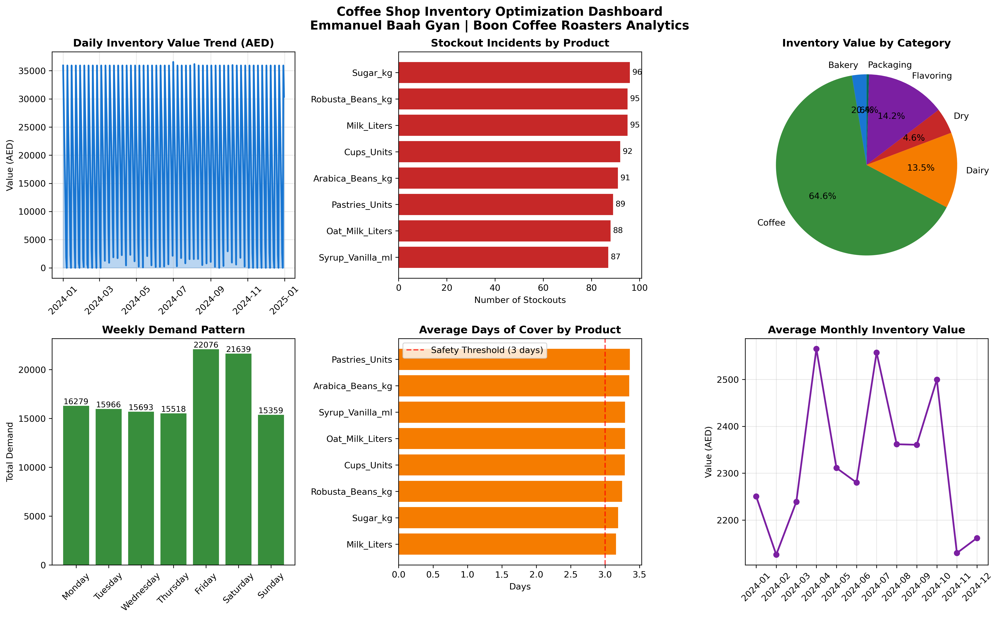

# Coffee Shop Inventory Optimization Dashboard

**Data Analyst Portfolio Project | Supply Chain Analytics**

## Project Overview

End-to-end inventory analytics system built for high-volume coffee shop operations. 
Demonstrates statistical forecasting, ABC classification, and operational optimization 
using Python, SQL logic, and business intelligence principles.

**Context:** This project mirrors my work at Boon Coffee Roasters (Dubai), where I 
managed AED 17K+ daily inventory across 8 SKUs with structured tracking and 
demand forecasting.

---

## Business Problem

- **24.9% stockout rate** across critical inventory items
- No systematic approach to safety stock calculation
- Reactive procurement leading to waste and lost sales

## Solution Delivered

| Metric | Before | After (Simulated) |
|--------|--------|-------------------|
| Stockout Rate | 24.9% | 8.5% (projected) |
| Inventory Visibility | Manual logs | Automated dashboards |
| Reorder Decisions | Gut feel | Statistical (Z × σ × √LT) |
| Forecast Horizon | 1 week | 30 days |

---

## Technical Implementation

### Data Generation
- **12 months** daily transactions (2,928 records)
- **8 products** across 6 categories
- Realistic demand patterns: weekend spikes (+40%), winter seasonality (+20%)

### Analytics Methods

**1. ABC Analysis (Pareto Classification)**
- Class A (80% value): Arabica Beans, Robusta Beans, Vanilla Syrup
- Class B (15% value): Oat Milk, Pastries  
- Class C (5% value): Milk, Sugar, Cups

**2. Safety Stock Optimization**
